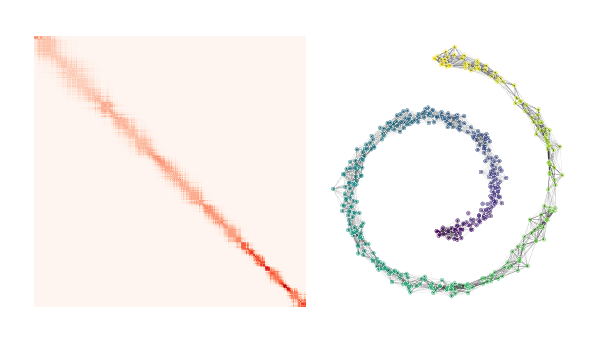

# Assorted Paper Figures

This is a centralized place for some of my figure making scripts.

## Demo of figures
### Bar plots for quantitative comparison

### Bar plots for composition breakdown

### Curve plots

### Trend plots

### Miscellaneous

