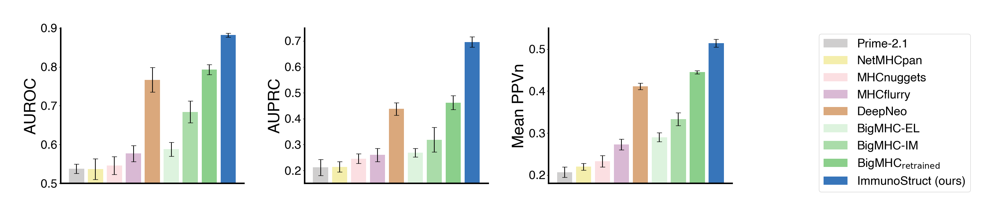

# Figures for Papers
[](https://www.linkedin.com/in/chenliu1996/)
[](https://x.com/ChenLiu_1996)
[](https://scholar.google.com/citations?user=3rDjnykAAAAJ&sortby=pubdate)

This is a centralized repository of my own **Python scripts for high-quality figures**.

I am [Chen Liu](https://chenliu-1996.github.io/), a Computer Science PhD Candidate at Yale University.


### Bar plots for quantitative comparison



### Bar plots for composition breakdown


### Trend plots


### Heat maps


### 3D spheres


### Miscellaneous: figures not made end-to-end in Python
These figures were made partially in Python. I included them to acknowledge the time and efforts I spent on them.


<br>
<br>
<br>

<br>

## LLM skill integration (credit to my friend [Shan Chen](https://shanchen.dev/))

<details>
<summary><strong>How to use the Scientific Figure Pro skill (click to expand)</strong></summary>

<br>

The repository includes an LLM skill guide plus reusable helper scripts:

- Skill guide: `skills/scientific-figure-pro/SKILL.md`
- Style rationale: `DESIGN_THEORY.md`
- Helper implementation: `skills/scientific-figure-pro/scripts/scientific_figure_pro.py`

### Simple AI workflow

1. Open this repository in Cursor.
2. Ask the AI to create or update a plotting script in your target folder (for example `figure_PROJECT_NAME/`).
3. In your prompt, explicitly ask it to follow `skills/scientific-figure-pro/SKILL.md` and `DESIGN_THEORY.md`.
4. Run the generated script and check the exported figure.

### Prompt template (copy/paste)

```text
Create a publication-quality figure script at <target_path>.
Use the Scientific Figure Pro skill conventions from:
- skills/scientific-figure-pro/SKILL.md
- DESIGN_THEORY.md

Load and use `skills/scientific-figure-pro/scripts/scientific_figure_pro.py` (apply_publication_style, make_* helpers, finalize_figure).
Input data: <describe your data or paste arrays>.
Output files: <name>.png and <name>.pdf.
Keep the style consistent with this repository.
```

</details>


## Related Papers
<details>
<summary>ImmunoStruct</summary>

[](https://www.nature.com/articles/s42256-025-01163-y)
[](https://www.nature.com/articles/s42256-025-01163-y.pdf)
[](https://github.com/KrishnaswamyLab/ImmunoStruct)
```bibtex
@article{givechian2025immunostruct,
  title={ImmunoStruct enables multimodal deep learning for immunogenicity prediction},
  author={Givechian, Kevin Bijan and Rocha, Jo{\~a}o Felipe and Liu, Chen and Yang, Edward and Tyagi, Sidharth and Greene, Kerrie and Ying, Rex and Caron, Etienne and Iwasaki, Akiko and Krishnaswamy, Smita},
  journal={Nature Machine Intelligence},
  pages={1--14},
  year={2025},
  publisher={Nature Publishing Group UK London}
}
```

</details>
<details>
<summary>Dispersion</summary>

[](https://arxiv.org/abs/2602.00217) 
[](https://arxiv.org/pdf/2602.00217)
```bibtex
@article{liu2026dispersion,
  title={Dispersion Loss Counteracts Embedding Condensation and Improves Generalization in Small Language Models},
  author={Liu, Chen and Sun, Xingzhi and Xiao, Xi and Van Tassel, Alexandre and Xu, Ke and Reimann, Kristof and Liao, Danqi and Gerstein, Mark and Wang, Tianyang and Wang, Xiao and others},
  journal={arXiv preprint arXiv:2602.00217},
  year={2026}
}
```

</details>
<details>
<summary>RNAGenScape</summary>

[](https://arxiv.org/abs/2510.24736) 
[](https://arxiv.org/pdf/2510.24736)
```bibtex
@article{liao2025rnagenscape,
  title={RNAGenScape: Property-Guided, Optimized Generation of mRNA Sequences with Manifold Langevin Dynamics},
  author={Liao, Danqi and Liu, Chen and Sun, Xingzhi and Tang, Di{\'e} and Wang, Haochen and Youlten, Scott and Gopinath, Srikar Krishna and Lee, Haejeong and Strayer, Ethan C and Giraldez, Antonio J and others},
  journal={arXiv preprint arXiv:2510.24736},
  year={2025}
}
```

</details>
<details>
<summary>brainteaser</summary>

[](https://openreview.net/forum?id=3oQDkmW72a)
[](https://openreview.net/pdf?id=3oQDkmW72a)
[](https://huggingface.co/datasets/ChenLiu1996/Brainteaser)
[](https://arxiv.org/abs/2505.10844) 
[](https://arxiv.org/pdf/2505.10844)
```bibtex
@article{han2025creativity,
  title={Creativity or Brute Force? Using Brainteasers as a Window into the Problem-Solving Abilities of Large Language Models},
  author={Han, Simeng and Dai, Howard and Xia, Stephen and Zhang, Grant and Liu, Chen and Chen, Lichang and Nguyen, Hoang Huy and Mei, Hongyuan and Mao, Jiayuan and McCoy, R. Thomas},
  journal={Advances in neural information processing systems},
  year={2025}
}
```

</details>
